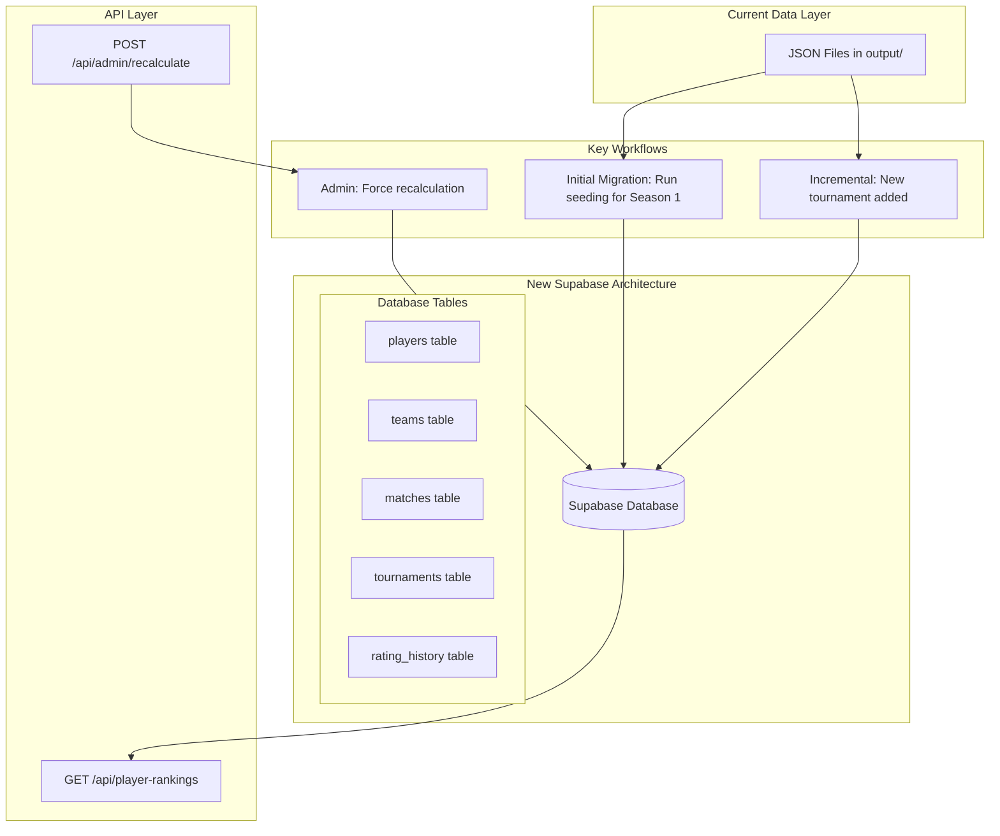
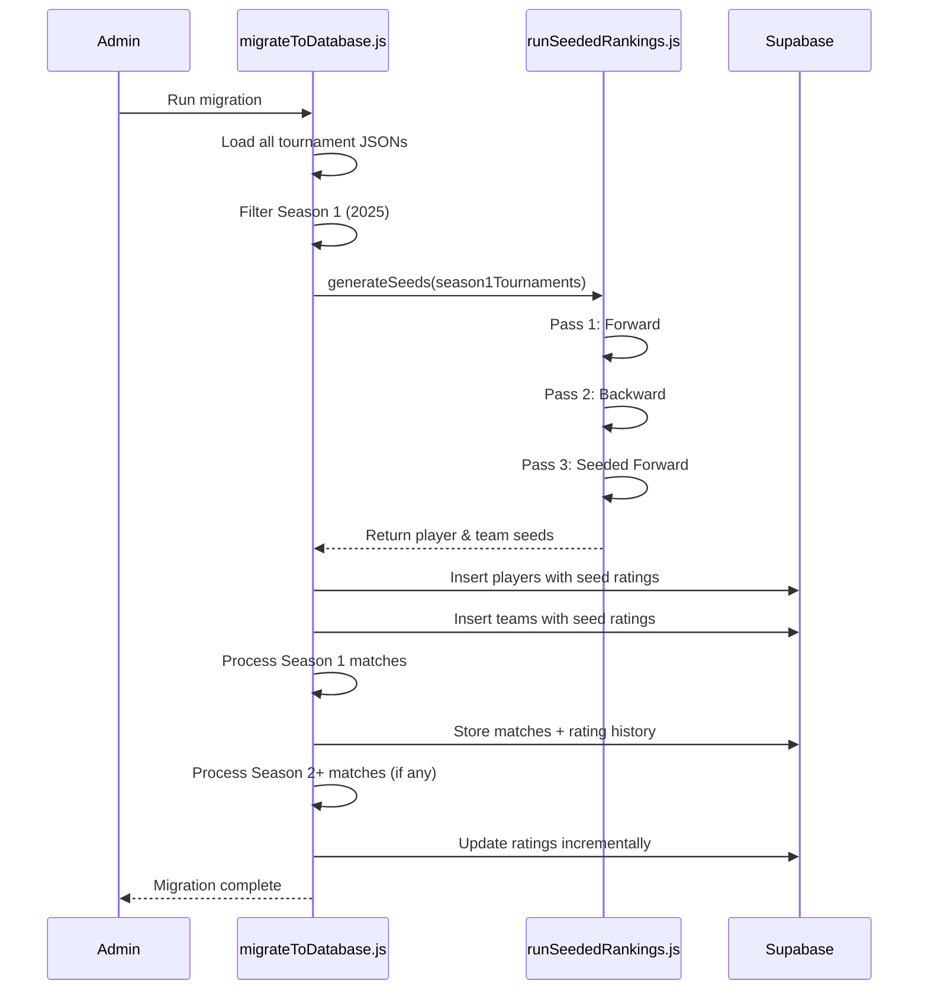

# Supabase Persistence Migration Plan

## Overview

Migrate the ranking system from calculating on every API request to a persistent Supabase database. Season 1 (2025) will be initialized with seeded rankings for better accuracy. New tournaments will update rankings incrementally.

## Architecture



## Phase 1: Supabase Setup & Schema

### 1.1 Create Supabase Tables

Create the following tables in Supabase:

**`tournaments`**

```sql
- id (uuid, primary key)
- name (text)
- liquipedia_slug (text, unique)
- date (date, not null)
- season (integer, computed: EXTRACT(YEAR FROM date))
- prize_pool (integer)
- format (text)
- created_at (timestamp)
- processed (boolean, default false)
```

**`players`**

```sql
- id (uuid, primary key)
- name (text, unique, not null)
- current_rating (numeric, default 0)
- current_confidence (numeric, default 0)
- matches (integer, default 0)
- wins (integer, default 0)
- losses (integer, default 0)
- created_at (timestamp)
- updated_at (timestamp)
```

**`teams`**

```sql
- id (uuid, primary key)
- player1_id (uuid, foreign key -> players)
- player2_id (uuid, foreign key -> players)
- team_key (text, unique, computed: sorted player names)
- current_rating (numeric, default 0)
- current_confidence (numeric, default 0)
- matches (integer, default 0)
- wins (integer, default 0)
- losses (integer, default 0)
- created_at (timestamp)
- updated_at (timestamp)
```

**`matches`**

```sql
- id (uuid, primary key)
- tournament_id (uuid, foreign key -> tournaments)
- match_id (text)
- round (text)
- date (timestamp)
- team1_id (uuid, foreign key -> teams)
- team2_id (uuid, foreign key -> teams)
- team1_score (integer)
- team2_score (integer)
- best_of (integer)
- processed (boolean, default false)
- created_at (timestamp)
```

**`rating_history`**

```sql
- id (uuid, primary key)
- entity_type (text: 'player' or 'team')
- entity_id (uuid)
- match_id (uuid, foreign key -> matches)
- rating_before (numeric)
- rating_after (numeric)
- rating_change (numeric)
- confidence (numeric)
- expected_win_probability (numeric)
- k_factor (numeric)
- timestamp (timestamp)
```

**Files to create:**

- `supabase/schema.sql` - SQL schema definitions
- `supabase/migrations/001_initial_schema.sql` - Initial migration

### 1.2 Setup Supabase Client

**Files to create:**

- `lib/supabase.js` - Supabase client configuration

**Implementation:**

```javascript
import { createClient } from '@supabase/supabase-js'

const supabaseUrl = process.env.SUPABASE_URL
const supabaseKey = process.env.SUPABASE_SERVICE_KEY

export const supabase = createClient(supabaseUrl, supabaseKey)
```

**Files to modify:**

- `package.json` - Add `@supabase/supabase-js` dependency
- `.env.example` - Document required environment variables

## Phase 2: Migration & Seeding

### 2.1 Initial Migration Script

**Files to create:**

- `tools/migrateToDatabase.js` - Main migration orchestrator

**Implementation logic:**

1. Check if database is empty (no tournaments)
2. Load all tournament JSON files from `output/`
3. Detect Season 1 tournaments (year === 2025)
4. Run seeding for Season 1 data
5. Import seeded ratings into database
6. Process Season 1 matches with seeded ratings
7. Store all match history with rating snapshots

**Key functions:**

```javascript
async function migrateToDatabase() {
  // 1. Load all tournaments
  const tournaments = await loadTournaments()
  
  // 2. Separate by season
  const season1 = tournaments.filter(t => getYear(t.date) === 2025)
  const otherSeasons = tournaments.filter(t => getYear(t.date) !== 2025)
  
  // 3. Run seeding for Season 1
  console.log('Running seeding for Season 1...')
  const { playerSeeds, teamSeeds } = await runSeeding(season1)
  
  // 4. Import into database
  await importSeedRatings(playerSeeds, teamSeeds)
  await processSeasonMatches(season1, true) // use seeds
  
  // 5. Process other seasons (if any)
  if (otherSeasons.length > 0) {
    await processSeasonMatches(otherSeasons, false)
  }
}
```

### 2.2 Integrate Seeding System

**Files to modify:**

- `tools/runSeededRankings.js` - Export seeding functions for programmatic use

**New exports:**

```javascript
export async function generateSeeds(tournaments) {
  // Run three-pass seeding on provided tournaments
  // Return: { playerSeeds: Map, teamSeeds: Map }
}
```

**Files to create:**

- `tools/databaseSeeding.js` - Bridge between seeding and database

**Implementation:**

```javascript
import { generateSeeds } from './runSeededRankings.js'
import { supabase } from '../lib/supabase.js'

export async function seedSeason1() {
  const season1Tournaments = await loadSeason1Tournaments()
  const { playerSeeds, teamSeeds } = await generateSeeds(season1Tournaments)
  
  // Import player seeds
  for (const [name, rating] of playerSeeds.entries()) {
    await supabase.from('players').upsert({
      name,
      current_rating: rating,
      current_confidence: 0
    })
  }
  
  // Import team seeds
  for (const [teamKey, rating] of teamSeeds.entries()) {
    const [player1, player2] = teamKey.split('+')
    await supabase.from('teams').upsert({
      team_key: teamKey,
      current_rating: rating,
      current_confidence: 0
    })
  }
}
```

## Phase 3: Incremental Updates

### 3.1 Match Processing Engine

**Files to create:**

- `tools/databaseRankingEngine.js` - Processes matches and updates database

**Key functions:**

```javascript
export async function processMatch(match) {
  // 1. Load current ratings from database
  const team1 = await getTeamRating(match.team1)
  const team2 = await getTeamRating(match.team2)
  
  // 2. Calculate rating changes
  const { team1Change, team2Change, history } = calculateRatingChange(
    team1, team2, match
  )
  
  // 3. Update database
  await supabase.from('teams').update({
    current_rating: team1.current_rating + team1Change,
    current_confidence: team1.new_confidence,
    matches: team1.matches + 1,
    wins: match.team1_score > match.team2_score ? team1.wins + 1 : team1.wins,
    losses: match.team1_score < match.team2_score ? team1.losses + 1 : team1.losses
  }).eq('id', team1.id)
  
  // 4. Store rating history
  await supabase.from('rating_history').insert(history)
}
```

### 3.2 Tournament Import Endpoint

**Files to modify:**

- `api/server.js` - Add endpoint to import new tournaments

**New endpoint:**

```javascript
// POST /api/admin/import-tournament
// Body: { filename: string }
app.post('/api/admin/import-tournament', async (req, res) => {
  const { filename } = req.body
  
  // 1. Check if already processed
  const tournament = await loadTournamentFromFile(filename)
  const existing = await supabase.from('tournaments')
    .select('id')
    .eq('liquipedia_slug', tournament.liquipedia_slug)
    .single()
  
  if (existing) {
    return res.status(400).json({ error: 'Tournament already imported' })
  }
  
  // 2. Insert tournament
  const { data: tournamentRecord } = await supabase.from('tournaments')
    .insert({ ...tournament })
    .select()
    .single()
  
  // 3. Process matches
  for (const match of tournament.matches) {
    await processMatch(match, tournamentRecord.id)
  }
  
  res.json({ success: true, tournament: tournamentRecord })
})
```

## Phase 4: API Updates

### 4.1 Update Ranking Endpoints

**Files to modify:**

- `api/server.js` - Replace calculation calls with database reads

**Changes:**

**Before:**

```javascript
app.get('/api/player-rankings', async (req, res) => {
  const { rankings } = await calculateRankings() // Slow
  res.json(rankings)
})
```

**After:**

```javascript
app.get('/api/player-rankings', async (req, res) => {
  const { data } = await supabase.from('players')
    .select('*')
    .order('current_rating', { ascending: false })
  res.json(data)
})
```

### 4.2 Historical Ratings API

**Files to modify:**

- `api/server.js` - Add endpoints for historical data

**New endpoints:**

```javascript
// GET /api/player/:id/history
// Returns rating history over time for a player

// GET /api/match/:id/ratings
// Returns rating snapshots for all players in a match
```

## Phase 5: Admin Recalculation

### 5.1 Recalculation Endpoint

**Files to modify:**

- `api/server.js` - Add admin recalculation endpoint

**New endpoint:**

```javascript
// POST /api/admin/recalculate
// Body: { season?: number } // Optional: specific season, default: all
app.post('/api/admin/recalculate', async (req, res) => {
  const { season } = req.body
  
  // 1. Reset ratings
  await supabase.from('players').update({
    current_rating: 0,
    current_confidence: 0,
    matches: 0,
    wins: 0,
    losses: 0
  })
  
  await supabase.from('teams').update({
    current_rating: 0,
    current_confidence: 0,
    matches: 0,
    wins: 0,
    losses: 0
  })
  
  // 2. Clear rating history
  await supabase.from('rating_history').delete().neq('id', '00000000-0000-0000-0000-000000000000')
  
  // 3. Re-run migration
  await migrateToDatabase()
  
  res.json({ success: true, message: 'Recalculation complete' })
})
```

**Files to create:**

- `tools/adminRecalculate.js` - Standalone recalculation script

## Phase 6: UI Updates

### 6.1 Remove Seeded Toggle

**Files to modify:**

- `src/pages/PlayerRankings.tsx` - Remove "Use Seeded Rankings" toggle
- `src/pages/TeamRankings.tsx` - Remove "Use Seeded Rankings" toggle

**Rationale:** Seeding is now automatically integrated for Season 1 in the database

### 6.2 Tournament Status Indicator

**Files to modify:**

- `src/pages/TournamentEditor.tsx` - Show if tournament is imported to database

**Add indicator:**

```typescript
{tournament.processed && (
  <span className="text-green-600 text-xs">✓ Rankings Updated</span>
)}
```

## Phase 7: Cleanup & Documentation

### 7.1 Deprecate Old Files

**Files to keep (but mark as legacy):**

- `tools/processRankings.js` - Keep for recalculation
- `tools/calculateTeamRankings.js` - Keep for recalculation
- `tools/calculateRaceRankings.js` - Keep for recalculation
- `tools/calculateTeamRaceRankings.js` - Keep for recalculation

**Add comment to each:**

```javascript
/**
 * LEGACY: This file is kept for admin recalculation purposes.
 * Normal API requests now read from Supabase database.
 */
```

### 7.2 Update Documentation

**Files to modify:**

- `README.md` - Document new Supabase architecture
- `docs/database-schema.md` - New file documenting schema
- `docs/seeding-system.md` - Document Season 1 seeding process

## Implementation Order

1. **Phase 1** - Setup Supabase schema and client
2. **Phase 2** - Create migration script and integrate seeding
3. **Phase 3** - Build incremental update engine
4. **Phase 4** - Update API endpoints to read from database
5. **Phase 5** - Add admin recalculation
6. **Phase 6** - Update UI
7. **Phase 7** - Documentation

## Migration Workflow



## Season Detection Logic

```javascript
function getSeason(date) {
  return new Date(date).getFullYear()
}

function isSeason1(date) {
  return getSeason(date) === 2025
}

async function shouldUseSeeding(tournament) {
  return isSeason1(tournament.date)
}
```

## Key Benefits

1. **Performance**: API requests read from database (fast)
2. **Historical data**: Rating at time of match stored
3. **Seeding integration**: Season 1 automatically uses seeded ratings
4. **Incremental updates**: New tournaments only process new matches
5. **Admin control**: Force recalculation when needed
6. **Scalability**: Grows with data, not recalculating everything

## Testing Strategy

1. Run migration with current 12 tournaments
2. Verify Season 1 rankings match seeded rankings
3. Test incremental import of new tournament
4. Test admin recalculation
5. Compare database rankings wit