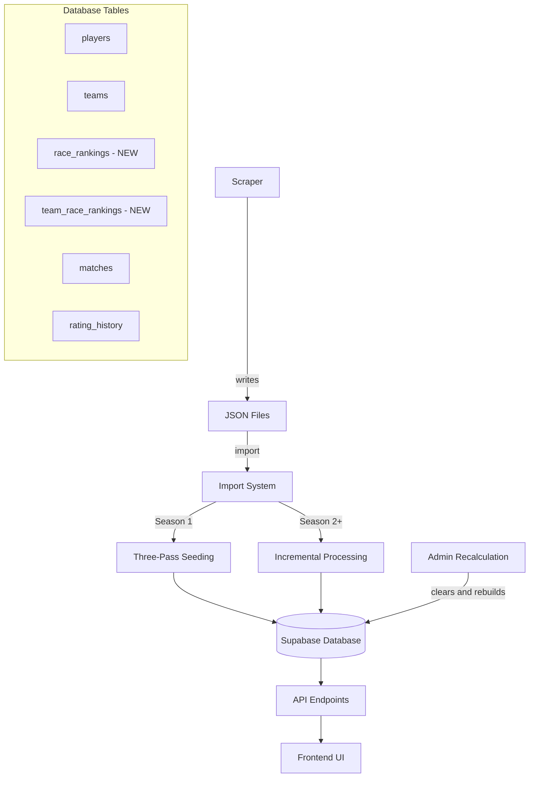

# Unified Ranking Architecture

## Problem Statement

Current system has inconsistencies:

- Player/Team rankings: Stored in database (fast, ~50-200ms)
- Race/Team-Race rankings: Calculated on-demand from JSON (slow, ~2-5s)
- Confusing terminology: "recalculation" actually means "import from JSON"
- `tools/calculations/` folder exists only for on-demand race rankings

## Goals

1. All ranking types use consistent database storage
2. Clear terminology: "import" (JSON → DB) vs "recalculation" (re-run calculations)
3. Simplified architecture: remove `tools/calculations/` folder
4. Better performance: race rankings from database

## Architecture Overview



## Phase 1: Database Schema - Add Race Ranking Tables

### 1.1 Create `race_rankings` Table

Stores individual player race matchup rankings (e.g., Protoss vs Zerg).

**Schema:**

```sql
CREATE TABLE race_rankings (
  id UUID PRIMARY KEY DEFAULT uuid_generate_v4(),
  race_matchup TEXT NOT NULL,  -- e.g., "PvZ", "TvP", "ZvZ"
  current_rating NUMERIC DEFAULT 0,
  current_confidence NUMERIC DEFAULT 0,
  matches INTEGER DEFAULT 0,
  wins INTEGER DEFAULT 0,
  losses INTEGER DEFAULT 0,
  created_at TIMESTAMP DEFAULT NOW(),
  updated_at TIMESTAMP DEFAULT NOW(),
  UNIQUE(race_matchup)
);
```

**Race matchups:** PvP, PvT, PvZ, TvT, TvZ, ZvZ (6 total)

### 1.2 Create `team_race_rankings` Table

Stores team race composition matchup rankings (e.g., PT vs ZZ = Protoss+Terran vs Zerg+Zerg).

**Schema:**

```sql
CREATE TABLE team_race_rankings (
  id UUID PRIMARY KEY DEFAULT uuid_generate_v4(),
  team_race_matchup TEXT NOT NULL,  -- e.g., "PT vs ZZ", "PP vs TT"
  current_rating NUMERIC DEFAULT 0,
  current_confidence NUMERIC DEFAULT 0,
  matches INTEGER DEFAULT 0,
  wins INTEGER DEFAULT 0,
  losses INTEGER DEFAULT 0,
  created_at TIMESTAMP DEFAULT NOW(),
  updated_at TIMESTAMP DEFAULT NOW(),
  UNIQUE(team_race_matchup)
);
```

**Team race matchups:** PP vs PP, PP vs PT, PP vs PZ, PT vs PT, etc. (21 total combinations)

### 1.3 Create Migration File

Create [`lib/migrations/002_race_rankings.sql`](lib/migrations/002_race_rankings.sql) with both table definitions.

## Phase 2: Update Ranking Engine - Calculate Race Rankings

### 2.1 Add Race Ranking Logic to Database Engine

Update [`tools/database/databaseRankingEngine.js`](tools/database/databaseRankingEngine.js):

**Current:** Processes matches and updates player/team ratings only.

**Add:** Function `processRaceRankings(match, tournamentId)` that:

1. Extracts player races from match data (using player_defaults.json)
2. Determines race matchups (e.g., P vs Z, T vs T)
3. Calculates rating changes using existing ranking logic
4. Updates `race_rankings` table
5. Stores history in `rating_history` table (entity_type = 'race')

### 2.2 Add Team Race Ranking Logic

Update [`tools/database/databaseRankingEngine.js`](tools/database/databaseRankingEngine.js):

**Add:** Function `processTeamRaceRankings(match, tournamentId)` that:

1. Extracts team race compositions (e.g., PT, ZZ)
2. Determines team race matchups (e.g., "PT vs ZZ")
3. Calculates rating changes
4. Updates `team_race_rankings` table
5. Stores history in `rating_history` table (entity_type = 'team_race')

### 2.3 Integrate into Match Processing

Update `processMatch()` in [`tools/database/databaseRankingEngine.js`](tools/database/databaseRankingEngine.js):

```javascript
export async function processMatch(match, tournamentId) {
  // Existing: Process player/team rankings
  await processPlayerTeamRankings(match, tournamentId);
  
  // NEW: Process race rankings
  await processRaceRankings(match, tournamentId);
  
  // NEW: Process team race rankings
  await processTeamRaceRankings(match, tournamentId);
}
```

### 2.4 Update Import/Recalculation Scripts

Both [`tools/recalculation/recalculateRankings.js`](tools/recalculation/recalculateRankings.js) and [`tools/database/databaseRankingEngine.js`](tools/database/databaseRankingEngine.js) will now automatically calculate all ranking types.

No changes needed - they already call `processMatch()`.

## Phase 3: Update API Endpoints - Read from Database

### 3.1 Update Race Ranking Endpoint

**File:** [`api/server.js`](api/server.js)

**Before:**

```javascript
app.get('/api/race-rankings', async (req, res) => {
  const { rankings } = await calculateRaceRankings(); // Slow, from JSON
  res.json(rankings);
});
```

**After:**

```javascript
app.get('/api/race-rankings', async (req, res) => {
  const { data, error } = await supabase
    .from('race_rankings')
    .select('*')
    .order('current_rating', { ascending: false });
  
  if (error) throw error;
  
  // Format for frontend
  const formatted = data.map(r => ({
    matchup: r.race_matchup,
    matches: r.matches,
    wins: r.wins,
    losses: r.losses,
    points: r.current_rating,
    confidence: r.current_confidence
  }));
  
  res.json(formatted);
});
```

### 3.2 Update Team Race Ranking Endpoint

**File:** [`api/server.js`](api/server.js)

**Before:**

```javascript
app.get('/api/team-race-rankings', async (req, res) => {
  const { rankings } = await calculateTeamRaceRankings(); // Slow, from JSON
  res.json(rankings);
});
```

**After:**

```javascript
app.get('/api/team-race-rankings', async (req, res) => {
  const { data, error } = await supabase
    .from('team_race_rankings')
    .select('*')
    .order('current_rating', { ascending: false });
  
  if (error) throw error;
  
  // Format for frontend
  const formatted = data.map(r => ({
    matchup: r.team_race_matchup,
    matches: r.matches,
    wins: r.wins,
    losses: r.losses,
    points: r.current_rating,
    confidence: r.current_confidence
  }));
  
  res.json(formatted);
});
```

### 3.3 Remove Obsolete Imports

Remove from [`api/server.js`](api/server.js):

```javascript
import { calculateRaceRankings } from '../tools/calculations/calculateRaceRankings.js';
import { calculateTeamRaceRankings } from '../tools/calculations/calculateTeamRaceRankings.js';
```

## Phase 4: Remove Obsolete Files

### 4.1 Delete `tools/calculations/` Folder

**Files to delete:**

- [`tools/calculations/calculateRaceRankings.js`](tools/calculations/calculateRaceRankings.js)
- [`tools/calculations/calculateTeamRaceRankings.js`](tools/calculations/calculateTeamRaceRankings.js)
- [`tools/calculations/processRankings.js`](tools/calculations/processRankings.js)
- [`tools/calculations/calculateTeamRankings.js`](tools/calculations/calculateTeamRankings.js)

These are no longer needed - all ranking calculations now happen via the database engine.

### 4.2 Remove Match History Endpoints (If Unused)

Check if these are used by frontend:

- `GET /api/race-match-history/:matchup`
- `GET /api/team-race-match-history/:matchup`

If not used, remove them from [`api/server.js`](api/server.js).

## Phase 5: Reorganize and Clarify Terminology

### 5.1 Rename/Reorganize for Clarity

**Current structure:**

```
tools/
├── recalculation/     # Actually does "import" AND "recalculation"
│   ├── recalculateRankings.js
│   └── runSeededRankings.js
├── database/          # Database operations
└── ranking/           # Core ranking math
```

**Proposed structure:**

```
tools/
├── import/            # JSON → Database (renamed from recalculation/)
│   ├── importFromJSON.js (renamed from recalculateRankings.js)
│   └── runSeededRankings.js
├── recalculation/     # Re-run calculations (NEW folder)
│   └── recalculateAllRankings.js (NEW - clears DB, calls import)
├── database/          # Database operations
└── ranking/           # Core ranking math
```

### 5.2 Create Clear Recalculation Script

**New file:** [`tools/recalculation/recalculateAllRankings.js`](tools/recalculation/recalculateAllRankings.js)

```javascript
/**
 * Recalculate All Rankings
 * 
 * Clears all ranking data and rebuilds from scratch.
 * Used when ranking algorithm changes or historical data is corrected.
 */
import { supabase } from '../../lib/supabase.js';
import { importFromJSON } from '../import/importFromJSON.js';

export async function recalculateAllRankings() {
  console.log('Clearing all ranking data...');
  
  // Clear all rankings
  await supabase.from('players').delete().neq('id', '00000000-0000-0000-0000-000000000000');
  await supabase.from('teams').delete().neq('id', '00000000-0000-0000-0000-000000000000');
  await supabase.from('race_rankings').delete().neq('id', '00000000-0000-0000-0000-000000000000');
  await supabase.from('team_race_rankings').delete().neq('id', '00000000-0000-0000-0000-000000000000');
  await supabase.from('matches').delete().neq('id', '00000000-0000-0000-0000-000000000000');
  await supabase.from('rating_history').delete().neq('id', '00000000-0000-0000-0000-000000000000');
  
  console.log('Re-importing from JSON...');
  await importFromJSON();
  
  console.log('Recalculation complete!');
}
```

### 5.3 Update Admin Endpoint

Update [`api/server.js`](api/server.js):

**Before:**

```javascript
const { recalculateRankings } = await import('../tools/recalculation/recalculateRankings.js');
await recalculateRankings();
```

**After:**

```javascript
const { recalculateAllRankings } = await import('../tools/recalculation/recalculateAllRankings.js');
await recalculateAllRankings();
```

## Phase 6: Documentation Updates

### 6.1 Update README

Update [`README.md`](README.md):

**Change:**

- "Hybrid System" → "Unified System"
- "Race/Team-Race Rankings: On-demand from JSON" → "All rankings: Stored in database"
- Update commands: `node tools/import/importFromJSON.js` for initial setup
- Update commands: `node tools/recalculation/recalculateAllRankings.js` for recalculation

### 6.2 Update TECHNICAL.md

Update [`docs/TECHNICAL.md`](docs/TECHNICAL.md):

**Add:**

- `race_rankings` table schema
- `team_race_rankings` table schema
- Clear distinction: Import vs Recalculation
- Update file structure section

### 6.3 Move Completed Plan

Move [`.cursor/plans/supabase_persistence_migration_c9449838.plan.md`](.cursor/plans/supabase_persistence_migration_c9449838.plan.md) to [`.cursor/completedplans/`](.cursor/completedplans/).

## Implementation Order

1. Phase 1: Create migration file, run migration on Supabase
2. Phase 2: Add race ranking logic to database engine
3. Phase 3: Update API endpoints to read from database
4. Phase 4: Delete obsolete `tools/calculations/` folder
5. Phase 5: Reorganize files and clarify terminology
6. Phase 6: Update documentation

## Testing Strategy

1. Run migration to add new tables
2. Run import: `node tools/import/importFromJSON.js`
3. Verify race rankings appear in database
4. Test API endpoints return race rankings from database
5. Verify performance improvement (should be ~50-200ms, not 2-5s)
6. Test recalculation: `node tools/recalculation/recalculateAllRankings.js`

## Key Benefits

1. Consistent architecture - all rankings work the same way
2. Better performance - race rankings ~10-20x faster
3. Clear terminology - import vs recalculation
4. Simpler codebase - remove `tools/calculations/` folder
5. Easier maintenance - one way to do things